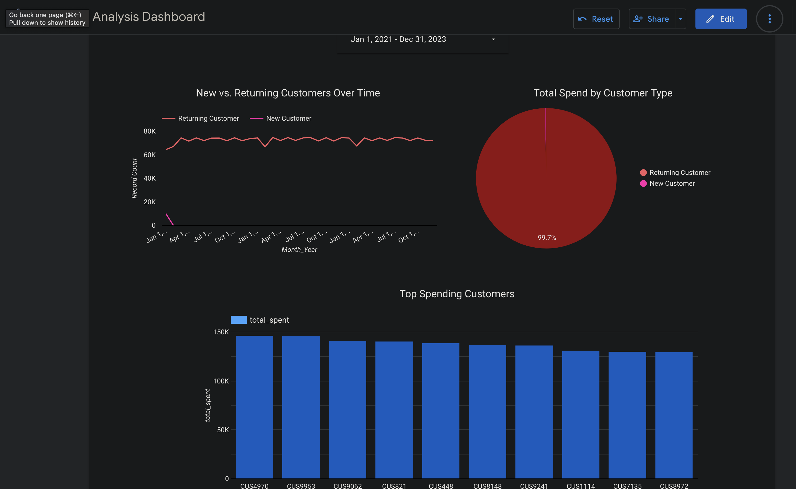
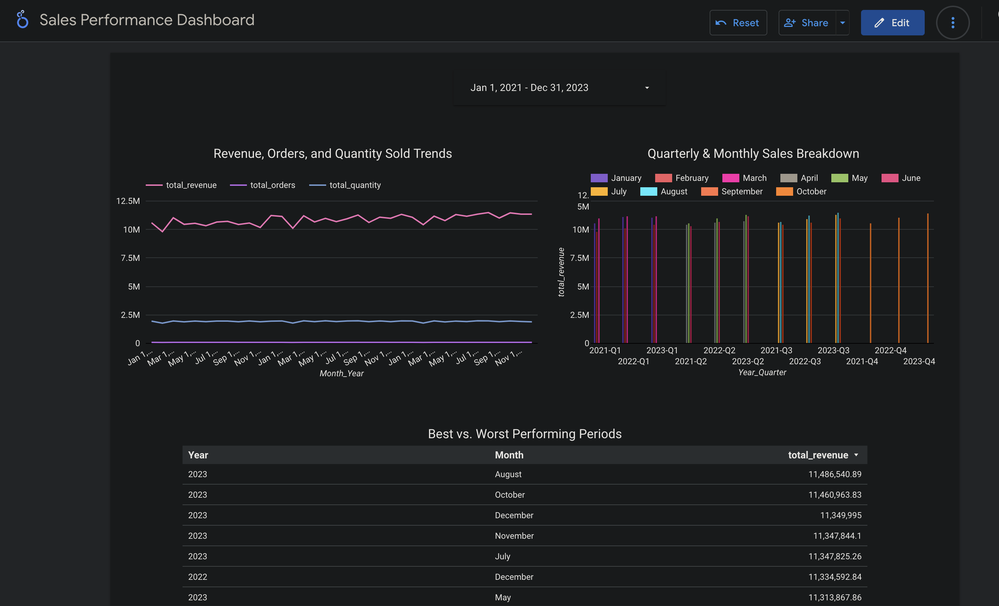
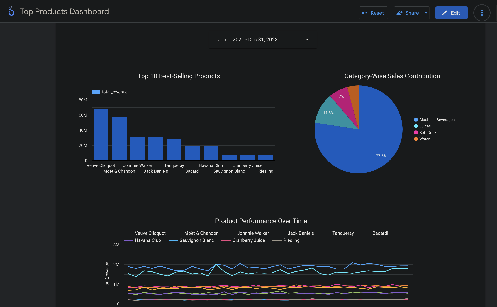
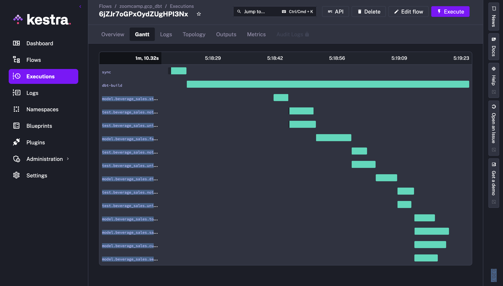
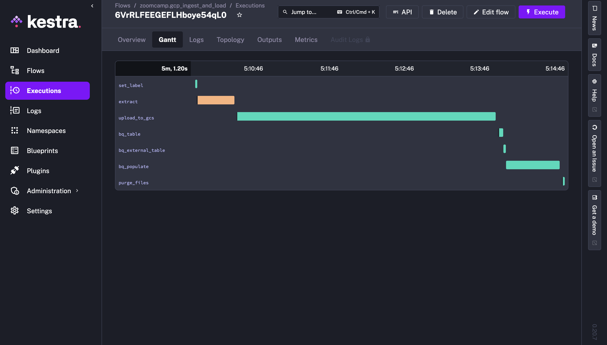
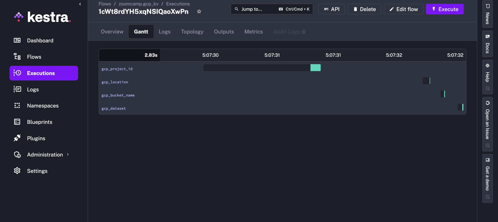
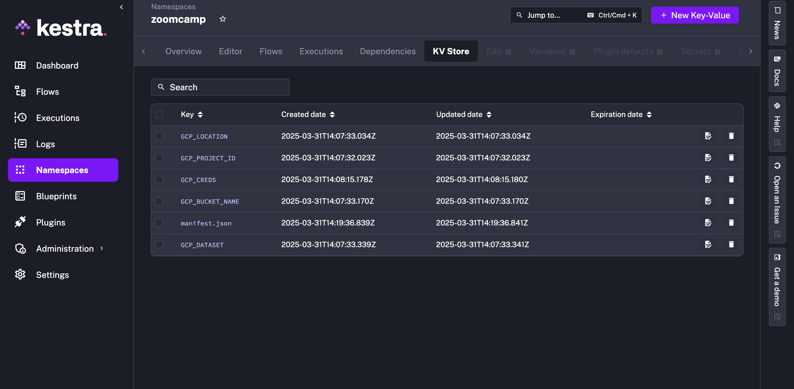

# Beverage Sales Data Engineering Project

## Overview

This project is a **cloud-based data engineering pipeline** for analyzing beverage sales. The pipeline ingests raw sales data, transforms it using **dbt**, and orchestrates workflows with **Kestra**. The processed data is stored in **Google BigQuery**, and insights are visualized through **Looker Studio dashboards**.

## Tech Stack

- **Orchestration**: [Kestra](https://kestra.io/) (workflow automation)
- **Transformations**: [dbt (Data Build Tool)](https://www.getdbt.com/) (data modeling and transformations)
- **Cloud Platform**: [Google Cloud Platform (GCP)](https://cloud.google.com/)
- **Infrastructure as Code**: [Terraform](https://www.terraform.io/)
- **Visualization**: [Looker Studio](https://lookerstudio.google.com/)

## Project Structure

```
.
├── README.md           # Project documentation
├── .env                # Environment variables (update as needed)
├── .env.example        # Example environment file
├── dashboard           # Looker Studio dashboards
├── dbt                 # dbt transformation logic
│   ├── beverage_sales  # dbt project directory
│   │   ├── models      # Core, marts, and staging models
│   │   ├── macros      # Custom dbt macros
│   │   ├── tests       # dbt tests
│   │   ├── seeds       # Seed data
│   │   ├── snapshots   # Snapshot tables
│   │   ├── dbt_project.yml # dbt project config
├── docker              # Docker configuration
│   └── docker-compose.yml # Services setup
├── kestra              # Kestra workflows for orchestration
│   ├── config.yml      # Kestra configuration
│   ├── flows           # Workflow definitions
│   └── data            # Ingested data
└── terraform           # Infrastructure as code
    ├── main.tf         # Terraform configuration
    ├── variables.tf    # Terraform variables
```

## Data Pipeline Workflow

1. **Data Ingestion**
   - Raw CSV data is stored in **Google Cloud Storage (GCS)**.
   - **Kestra** orchestrates ingestion into an **external BigQuery table**.
2. **Transformations with dbt**
   - The data is **cleaned, modeled, and enriched** into core fact and dimension tables.
   - Analytical tables include **customer insights, sales performance, seasonal trends, and top products**.
3. **Orchestration with Kestra**
   - Automates **data loading, transformations, and scheduled runs**.
4. **Visualization in Looker Studio**
   - Data is presented in **interactive dashboards** for analysis.

## Looker Studio Dashboards

- **[Customer Analysis Dashboard](https://lookerstudio.google.com/s/vGrY7Oto0Bc)**



- **[Sales Performance Dashboard](https://lookerstudio.google.com/s/s3OlLa5uu4c)**



- **[Top Products Dashboard](https://lookerstudio.google.com/s/geizRYsycDU)**



- **[Seasonal Trends Dashboard](https://lookerstudio.google.com/s/gZJWip1OKGE)**


## Deployment & Setup

### Prerequisites

- Google Cloud project with **BigQuery and Cloud Storage** enabled.
- Terraform installed (`brew install terraform` or [download](https://www.terraform.io/downloads)).
- Docker installed (`brew install docker` or [Docker Desktop](https://www.docker.com/products/docker-desktop)).

### Setup Instructions

1. **Clone the repository**:

   ```bash
   git clone https://github.com/Sharonsyra/zoompcamp-project
   cd zoomcamp-project
   ```

2. **Make a copy of the `.env.example` file and rename it to `.env`**:

   ```bash
   cp .env.example .env
   ```

3. **Fill `.env` with your Google Cloud credentials**.

4. **Run this script to set up secrets for Kestra**:

   ```bash
   x=23  # Change this to the line number you want to start from

   awk "NR >= $x" .env | while IFS='=' read -r key value; do
       echo "SECRET_$key=$(echo -n "$value" | base64)"
   done >> .env  # Append to the existing .env file
   ```

5. **Set Environment Variables**:

   ```bash
   set -o allexport; source .env; set +o allexport
   ```

6. **Deploy infrastructure with Terraform**:

   ```bash
   cd terraform
   terraform init
   terraform apply
   ```

7. **Start Docker Services**:

   ```bash
   cd docker
   docker-compose --env-file ../.env up --build
   ```

8. **Updating `staging/schema.yml`**

   Before running `dbt`, you must edit `dbt/beverage_sales/models/staging/schema.yml` with your GCP details. Update the following section:

   ```yaml
   sources:
     - name: staging
       database: <YOUR_GCP_PROJECT_ID>  # Replace with your actual GCP project ID
       schema: <YOUR_GCP_DATASET>        # Replace with your actual BigQuery dataset

       tables:
         - name: <YOUR_DATA_TABLE_NAME>  # Replace with your actual table name
   ```

   Make sure the values match those in your `.env` file.

9. **Run dbt transformations**:

   ```bash
   cd dbt/beverage_sales
   dbt compile
   dbt run
   ```


10. **Access dashboards in Looker Studio** (links above).

## Adding GCP Credentials to Kestra's Keystore

To securely store your Google Cloud Service Account JSON, follow these steps:

1. Open the **Kestra UI** at [http://localhost:8080](http://localhost:8080).
2. Navigate to **Namespaces** → **Keystore**.
3. Select the **zoomcamp** namespace.
4. Click **KV Store** and enter the following:
   - **Key:** `GCP_CREDS`
   - **Type:** `JSON`
   - **Value:** Paste the contents of your `service-account.json` file.
5. Click **Save**.

Once added, the service account credentials will be securely accessible inside Kestra workflows.

## Running Kestra Flows

1. **Load Kestra KV Store**

   - Open **Kestra UI** at [http://localhost:8080](http://localhost:8080).
   - Navigate to **Flows**.
   - Select **`zoomcamp.gcp_kv`**.
   - Click the **Execute** button (top-right).
   - Ensure `GCS_CREDS` is set as pointed out in the instructions above.

2. **Ingest Data**

   - Open **Kestra UI** at [http://localhost:8080](http://localhost:8080).
   - Navigate to **Flows**.
   - Select **`zoomcamp.gcp_ingest_and_load`**.
   - Click the **Execute** button (top-right).

3. **Run dbt Transformations**

   - Open **Kestra UI** at [http://localhost:8080](http://localhost:8080).
   - Navigate to **Flows**.
   - Select **`zoomcamp.gcp_dbt`**.
   - Click the **Execute** button (top-right).
   - This only runs on my gcp instance given it is syncing from github, just an extra flow.

## Kestra Images

gcp_dbt_flow



gcp_ingest_and_load



gcp_kv



zoomcamp_kv_store



## Future Improvements

- Implement **data quality checks** using **Great Expectations**.
- Optimize **cost efficiency** in BigQuery storage.
- Add **real-time streaming** with Pub/Sub and Dataflow.

## Contributors

- **Sharon Waithîra** – [GitHub](https://github.com/Sharonsyra)
